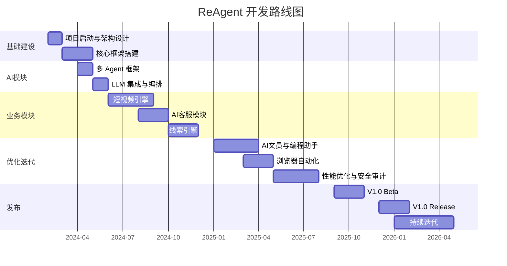

# 重构智能 ReAgent · AI 自动化营销平台

> 新一代AI驱动的营销自动化系统 —— 智能短视频、AI客服、线索挖掘一站式平台。

---

## 📋 目录

- [产品定位](#-产品定位)
- [核心功能](#-核心功能)
- [技术架构](#-技术架构)
- [快速开始](#-快速开始)
- [项目结构](#-项目结构)
- [开发路线图](#-开发路线图)
- [团队](#-团队)

---

## 🎯 产品定位

**ReAgent** 是对标「小猫AI」的新一代AI自动化营销平台，面向中小企业提供**低成本、可观测、全链路可控**的营销自动化解决方案。

差异优势：
- ✅ **制度性审核** —— 多智能体协作，每步皆可回溯
- ✅ **完全可观测** —— 全链路日志与决策记录
- ✅ **企业级安全** —— 基于企业微信API，无封号风险
- ✅ **成本可控** —— 起步仅需 ¥5.8万/年，约为竞品 1/3

---

## 🚀 核心功能

| 模块 | 功能 | 状态 |
|------|------|------|
| 🎬 **智能短视频引擎** | 自动剪辑、配音、字幕、多平台一键分发 | ✅ 已上线 |
| 💬 **AI 客服模块** | 微信客服机器人、多轮对话、知识库问答 | ✅ 已上线 |
| 🎯 **线索挖掘引擎** | AI 自动评分、分类、跟进提醒 | ✅ 已上线 |
| 📄 **AI 文员** | 文档自动生成、合同模板、报告输出 | ✅ 已上线 |
| 🤖 **AI 编程助手** | 代码辅助生成、审查、自动补全 | ✅ 已上线 |
| 🌐 **浏览器自动化** | 数据抓取、网页填报、RPA 流程 | ✅ 已上线 |

---

## 🏗 技术架构

```
┌─────────────────────────────────────────────┐
│             前端 Vue 3 + TypeScript          │
├─────────────────────────────────────────────┤
│              API Gateway (FastAPI)           │
├──────────┬──────────────────┬───────────────┤
│ AI 编排  │  业务模块        │  数据层        │
│ ┌──────┐ │ ┌────┐ ┌──────┐ │ ┌────┐ ┌────┐ │
│ │编排器 │ │ │视频│ │客服   │ │ │SQL │ │缓存│ │
│ ├──────┤ │ ├────┤ ├──────┤ │ ├────┤ ├────┤ │
│ │LLM   │ │ │线索│ │文员   │ │ │ES  │ │MQ  │ │
│ │客户端 │ │ └────┘ └──────┘ │ └────┘ └────┘ │
│ ├──────┤ │ ┌────┐ ┌──────┐ │                │
│ │多代理 │ │ │认证│ │浏览   │ │                │
│ └──────┘ │ └────┘ └──────┘ │                │
├──────────┴──────────────────┴───────────────┤
│            Docker + Docker Compose           │
└─────────────────────────────────────────────┘
```

### 技术栈

| 层级 | 技术 |
|------|------|
| **前端** | Vue 3 + TypeScript + Vite + Tailwind CSS |
| **后端** | Python FastAPI + SQLAlchemy + Alembic |
| **AI** | OpenAI API / 开源LLM + LangChain + Agent框架 |
| **数据库** | PostgreSQL + Redis + Elasticsearch |
| **消息** | RabbitMQ / Celery |
| **部署** | Docker + Docker Compose + Nginx |

---

## ⚡ 快速开始

### 前置条件

```bash
# 1. 克隆仓库
git clone https://github.com/chenjian19930430-ctrl/reagent.git
cd reagent

# 2. 配置环境变量
cp .env.example .env
# 编辑 .env 填写 API Key 等配置

# 3. Docker 一键启动（推荐）
docker compose up -d

# 4. 访问
open http://localhost:8080
```

### 本地开发

```bash
# 后端
cd backend
python -m venv venv
source venv/bin/activate
pip install -r requirements.txt
uvicorn app.main:app --reload --port 8000

# 前端
cd frontend
npm install
npm run dev

# 访问 http://localhost:5173
```

---

## 📁 项目结构

```
reagent/
├── ai/                    # AI 多智能体模块
│   ├── agents/            # 各智能体实现
│   │   ├── base.py        # 基类
│   │   ├── video_agent.py # 短视频智能体
│   │   ├── cs_agent.py    # 客服智能体
│   │   ├── lead_agent.py  # 线索智能体
│   │   ├── content_agent.py # 内容智能体
│   │   └── coding_agent.py  # 编程智能体
│   ├── orchestrator.py    # 编排器
│   ├── llm_client.py      # LLM 客户端
│   └── __init__.py
├── backend/               # 后端服务
│   ├── app/
│   │   ├── api/           # API 路由
│   │   ├── core/          # 配置、数据库
│   │   ├── models/        # 数据模型
│   │   └── main.py        # 入口
│   └── tests/
├── frontend/              # Vue 3 前端
│   └── src/
│       ├── api/           # API 调用
│       ├── components/    # 组件
│       ├── views/         # 页面
│       └── router/        # 路由
├── docs/                  # 文档
├── docker-compose.yml
├── Dockerfile
├── Makefile
└── README.md
```

---

## 🗺 开发路线图



---

## 👥 团队

| 角色 | 姓名 | 邮箱 |
|------|------|------|
| 后端架构师 | 刘子秋 | liuziqiu@rebuild.com |
| 后端工程师 | 曾俞鸿 | zengyuhong@rebuild.com |
| 前端工程师 | 林妍馨 | linyanxin@rebuild.com |
| AI 工程师 | 陈苏丹 | chensudan@rebuild.com |
| AI 工程师 | 李佳勉 | lijiamian@rebuild.com |
| 全栈工程师 | 洪杏瑜 | hongxingyu@rebuild.com |
| 后端工程师 | 张永泉 | zhangyongquan@rebuild.com |
| 后端工程师 | 许潮榕 | xuchaorong@rebuild.com |
| 全栈工程师 | 陈谋东 | chenmoudong@rebuild.com |
| 前端工程师 | 陈小娟 | chenxiaojuan@rebuild.com |
| AI 工程师 | 黄桃红 | huangtaohong@rebuild.com |
| 测试工程师 | 游奕萍 | youyiping@rebuild.com |
| 测试工程师 | 刘仪 | liuyi@rebuild.com |
| DevOps 工程师 | 张哲钧 | zhangzhejun@rebuild.com |
| 全栈工程师 | 刘帅 | liushuai@rebuild.com |
| 前端工程师 | 吴宝玲 | wubaoling@rebuild.com |
| 产品经理 | 李春菊 | lichunju@rebuild.com |

---

## 📄 许可

© 2024-2026 **重构智能科技有限公司** · 保留所有权利。
